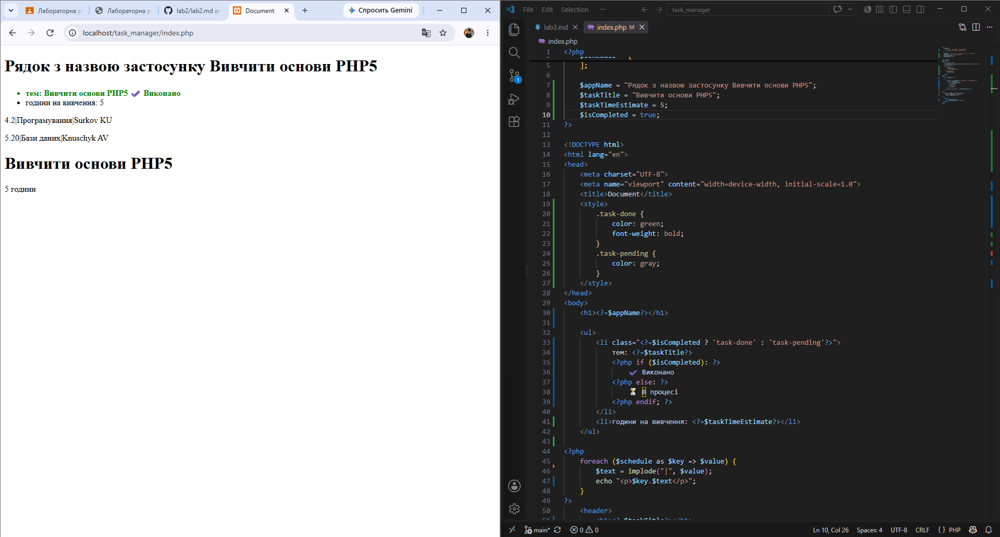

# Звіт до лабораторної роботи №3

## 1. Код програми ( index.php )

```
## 2. Результат виконання



<?php
    $schedule = [
        4=>[2,"Програмування", "Surkov KU"],
        5=>[20,"Бази даних", "Knuschyk AV"],
    ];

    $appName = "Вивчити основи PHP5";
    $taskTitle = "Вивчити основи PHP5";
    $taskTimeEstimate = 5;
    $isCompleted = true;

?>

<!DOCTYPE html>
<html lang="en">
<head>
    <meta charset="UTF-8">
    <meta name="viewport" content="width=device-width, initial-scale=1.0">
    <title>Document</title>
</head>
<body>
    <h1>
        <?=$appName?>
    </h1>
    <ul>
        <li> class="<?=$isCompleted ? "task-done" : "task-pending" ?>">
            тем: <?=$taskTitle?>
        <?php if ($isCompleted): ?>
            ✔️ Виконано
        <?php else: ?>
            ⏳ В процесі
        <?php endif; ?>
        </li>
        <li> години на вивчення: <?=$taskTimeEstimate?></li>
    </ul>
<?php
    foreach ($schedule as $key => $value) {
        $text = implode("|", $value);
            echo "<p>$key.$text</p>";
    }
?>
    <header>
        <h1>
            <?=$taskTitle?> </li>
            <li><?=$taskTimeEstimate?>години</li>
        </h1>
    </header>
</body>
</html>

# Відповіді на контрольні запитання
1. Які оператори порівняння існують у PHP (назвіть мінімум 4)?

1) Доревнює (==)
2) Тотожно дорівнює (===)
3) Не дорівнює (!= або <>)
4) Більше / менше (>, <) 
5) Більше або дорівнює / менше або дорівнює (>=, <=)

2. У чому різниця між тотожним порівнянням (===) та звичайним прирівнюванням (==) у PHP? Наведіть приклад, де результати відрізнятимуться.

1) Оператор == порівнює значення після приведення типів (наприклад, число та рядок з числом вважаються рівними).
2) Оператор === порівнює і значення, і тип даних без автоматичного приведення.
Приклад:
5=="5" повертає true, тому що рядок "5" перетворюється на число 5.
5==="5" повертає false, тому що один операнд — це integer, а інший — string.

3. Для чого потрібен альтернативний синтаксис керуючих конструкцій (if (...): ... endif;) під час роботи з HTML?
Він дозволяє зручно змішувати PHP-код та HTML-розмітку, роблячи код значно чистішим та читабельнішим. Замість великої кількості фігурних дужок {} використовуються двоїкрапки та закриваючі блоки (endif;, endforeach;), що запобігає плутанині при вкладених блоках.
4. Що таке тернарний оператор і який він має синтаксис? Коли його використання є недоцільним?

Тернарний оператор — це скорочена форма умовної конструкції if-else.
Синтаксис: умова ? значення_якщо_true : значення_якщо_false;
Недоцільно використовувати: при складних багатоінструкційних блоках або при значній кількості вкладених умов, оскільки це сильно погіршує читабельність коду.
5. Які значення в PHP приводяться до false при перетворенні типів (type juggling) в умові if?
До false приводяться такі значення:
Сам булевий false
Ціле число 0 та число з плаваючою крапкою 0.0
Порожній рядок "" та рядок "0"
Порожній масив []
Спеціальне значення NULL (включно з неустановленими змінними)
Об'єкти SimpleXML, створені з порожніх тегів