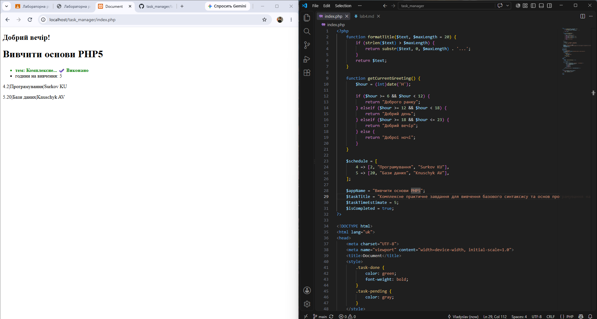

# Звіт до лабораторної роботи №4

## 1. Створені функції 

```
php
function formatTitle($text,$maxLength = 20) {
    if (strlen($text) >$maxLength) {
    return substr($text, 0,$maxLength) . '...';
}
return $text;
}
function getCurrentGreeting() {
    $hour = (int)date('H');
    
    if ($hour >= 6 &&$hour < 12) {
        return "Доброго ранку";
    } elseif ($hour >= 12 &&$hour < 18) {
        return "Добрий день";
    } elseif ($hour >= 18 &&$hour <= 23) {
        return "Добрий вечір";
    } else {
        return "Доброї ночі";
    }
}
```
## 2. Результат виконання



## 3. Відповіді на контрольні запитання

1. **Поясніть принцип “DRY” (Don’t Repeat Yourself) та як власні функції допомагають його дотримуватись.**
   Принцип DRY означає уникнення дублювання коду. Якщо один і той самий логічний блок потрібно використати кілька разів, його оформлюють у власну функцію. Це дозволяє просто викликати функцію за потреби, що зменшує обсяг коду та полегшує його редагування (зміни вносяться лише в одному місці — всередині функції).

2. **Що таке аргументи функції та що таке параметри за замовчуванням? Наведіть приклад з коду.**
   Аргументи — це вхідні дані, які передаються у функцію при її виклику. Параметри за замовчуванням — це значення, які функція використовує автоматично, якщо під час виклику для них не передали аргумент.
   *Приклад:* У створеній функції `formatTitle($text, $maxLength = 20)`, змінна `$maxLength` має значення за замовчуванням `20`. Якщо викликати `formatTitle("Рядок")`, довжина автоматично вважатиметься 20.

3. **Що станеться, якщо у функції не написати конструкцію `return`, але спробувати присвоїти результат її виклику в змінну `$x` (`$x = myFunc()`)? Яке значення буде в `$x`?**
   Якщо функція не має інструкції `return` (або `return` порожній), вона автоматично повертає спеціальне значення `NULL`. Отже, змінна `$x` набуде значення `NULL`.

4. **Що таке “область видимості” (scope) змінної? Чи можна у тілі функції звернутись до `$taskTitle`, створеної за межами цієї функції, без ключового слова `global`?**
   Область видимості визначає контекст, у якому змінна доступна для використання. У PHP змінні, створені поза функцією, мають глобальну область видимості і не доступні всередині функцій за замовчуванням. Тому звернутися до `$taskTitle` всередині функції без ключового слова `global` не можна (буде помилка).

5. **Для чого призначена вбудована функція `substr()` і які вона умовно приймає аргументи?**
   Функція `substr()` призначена для вирізання та повернення частини рядка (підрядка). 
   Вона приймає три аргументи:
   1) Рядок, який потрібно обробити (обов'язковий).
   2) Початкова позиція (індекс), з якої починається вирізання (обов'язковий, нумерація з нуля).
   3) Довжина підрядка (необов'язковий). Якщо не вказати, виріже до кінця рядка.